# Diagrams

Diagrams are written in [Mermaid](https://mermaid.js.org). They render on GitHub, in IntelliJ (Mermaid
plugin) and at https://mermaid.live - paste a block there and export a PNG/SVG for the report.
They are generated from the current code, so they match what the system actually does.

---

## 1. ER diagram (database)

Tables are created by Hibernate from the `model/` entities. Solid lines are real foreign keys.
Users are linked to their data by **username** (a logical link, not a foreign key), so deleting a user
keeps their booking and review history.

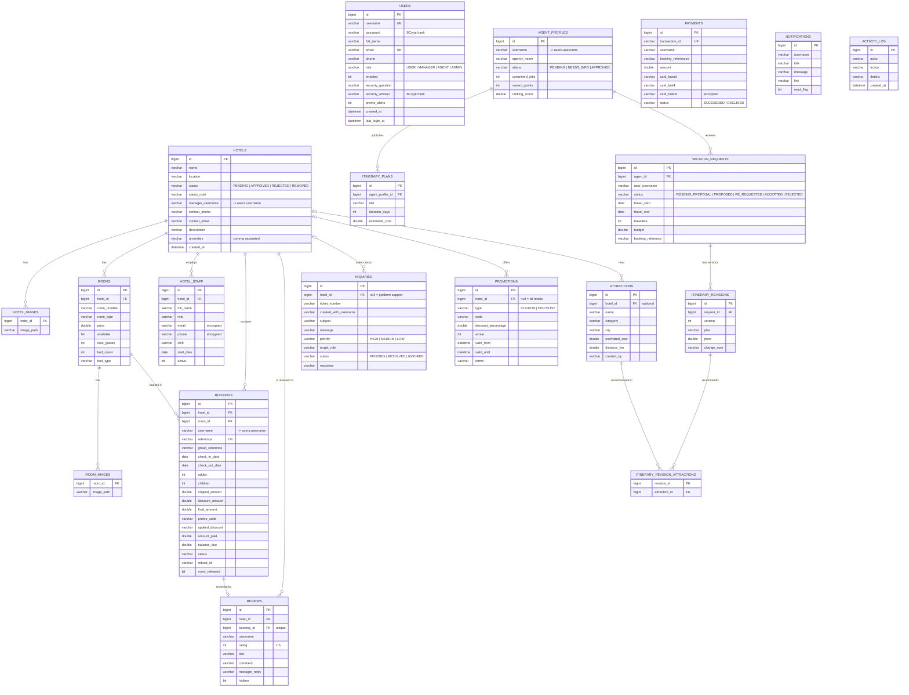

---

## 2. Class diagram (domain model)

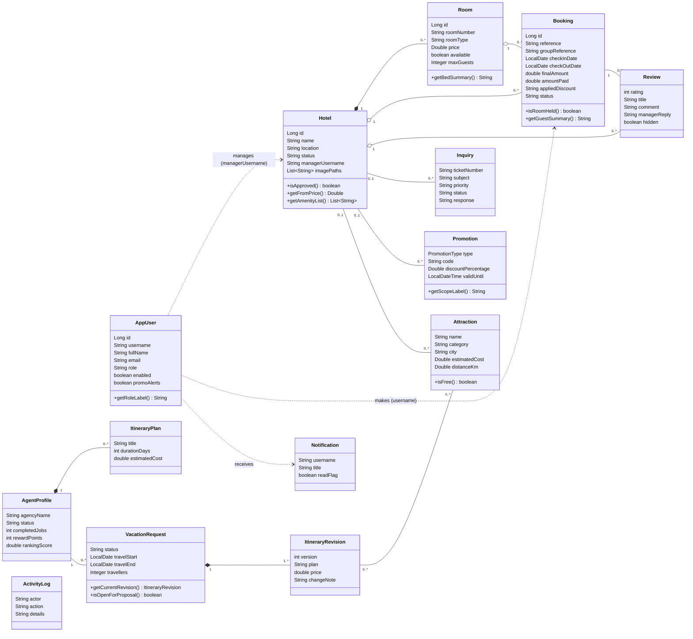

---

## 3. Class diagram (design patterns)

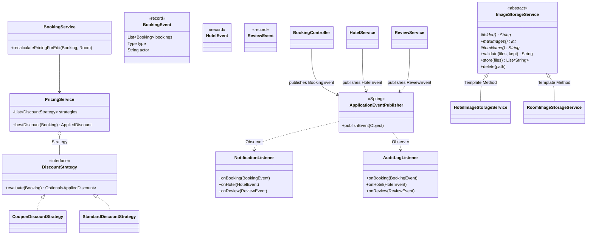

---

## 4. Booking status (state diagram)

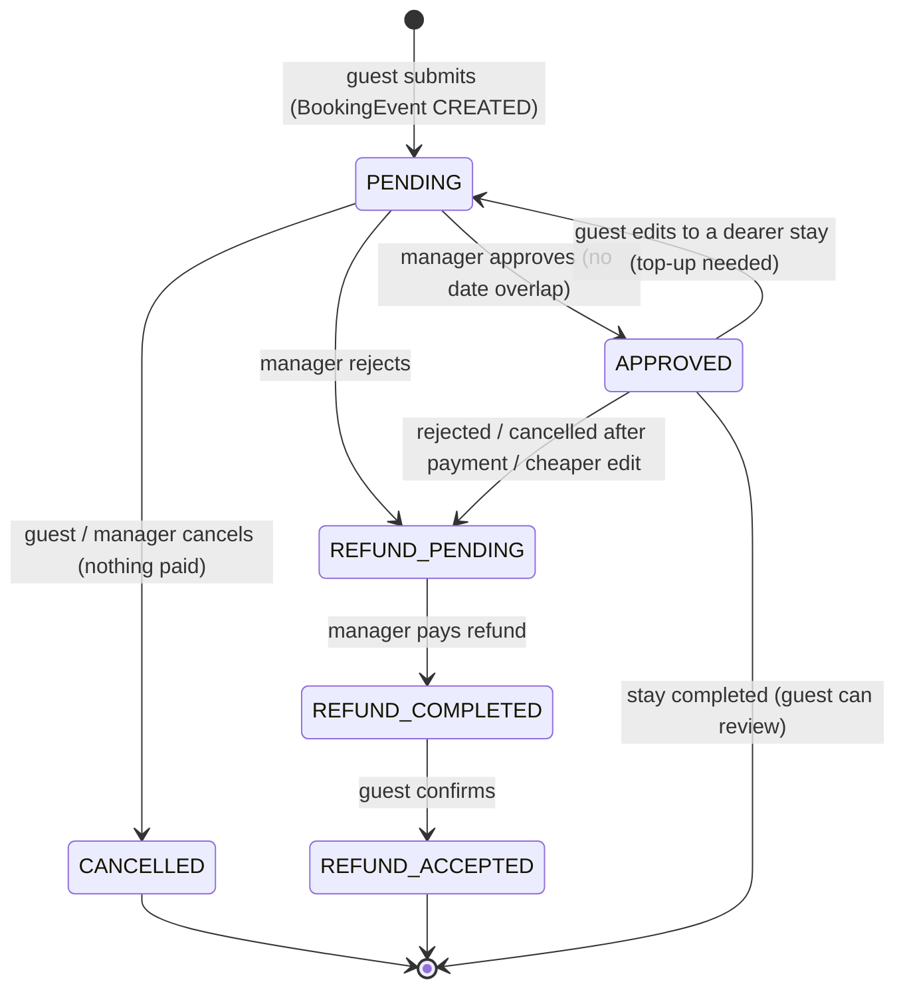

---

## 5. Use case diagrams

Mermaid has no UML use-case notation, so actors are drawn as rounded nodes, use cases as ovals and the
system boundary as a box. 5.1 shows which actors take part in each major function. 5.2 - 5.5 show each
actor's use cases, and together they cover every use case in the system.

### 5.1 Overview - actors and the six major functions

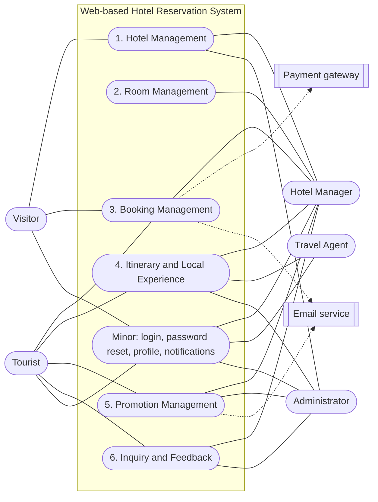

### 5.2 Tourist and Visitor

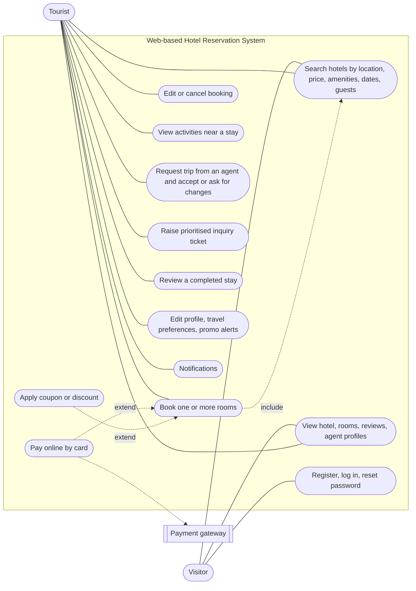

### 5.3 Hotel Manager

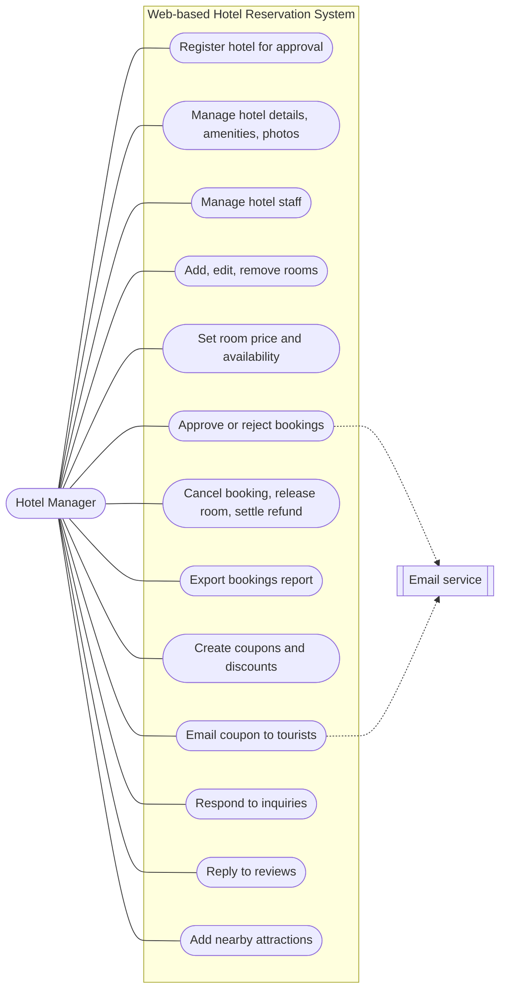

### 5.4 Travel Agent

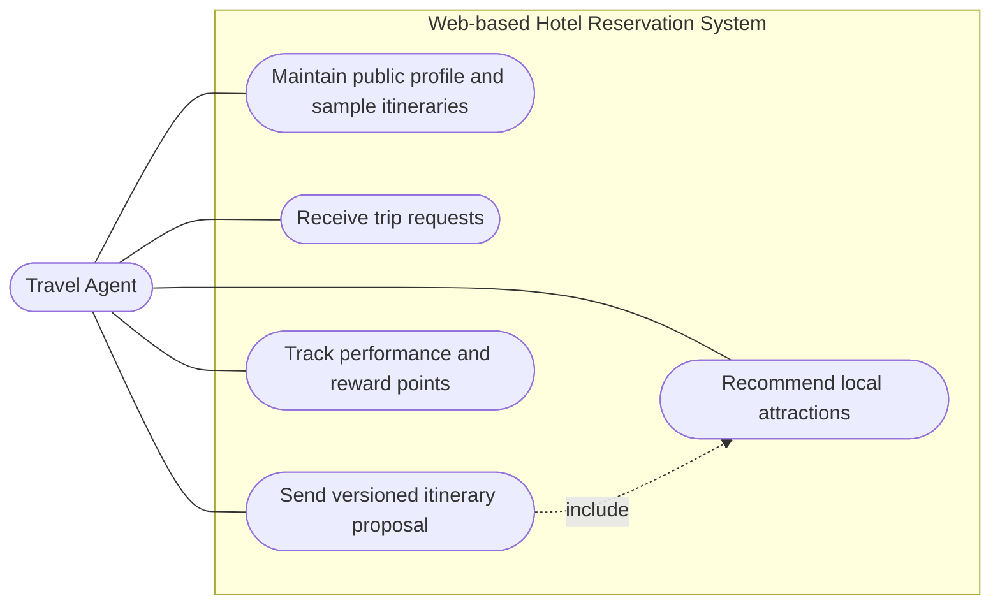

### 5.5 Administrator

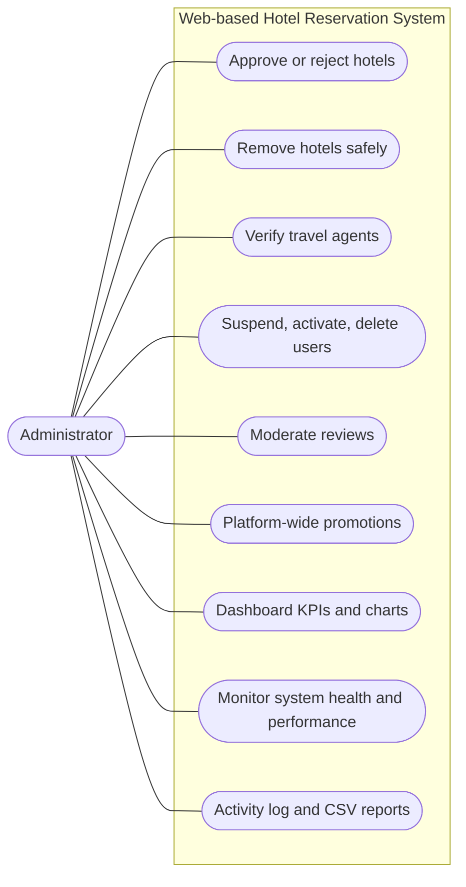

---

## 6. Activity diagrams (one per major function)

Each diagram follows the real code path, including the checks that can stop the flow.

### 6.1 Hotel Management - `HotelController`, `HotelService`, `StaffController`

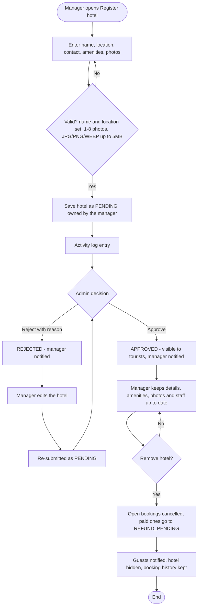

### 6.2 Room Management - `RoomController`, `RoomService`

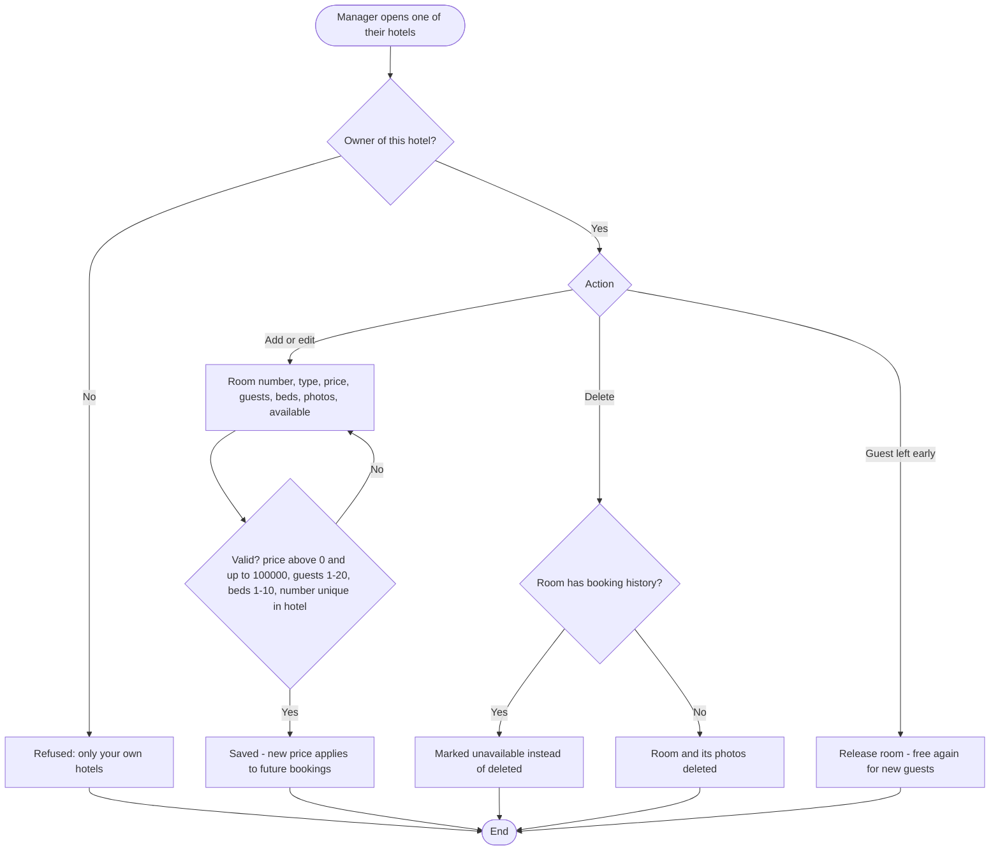

### 6.3 Booking Management - `BookingController`, `PaymentService`, `BookingService`

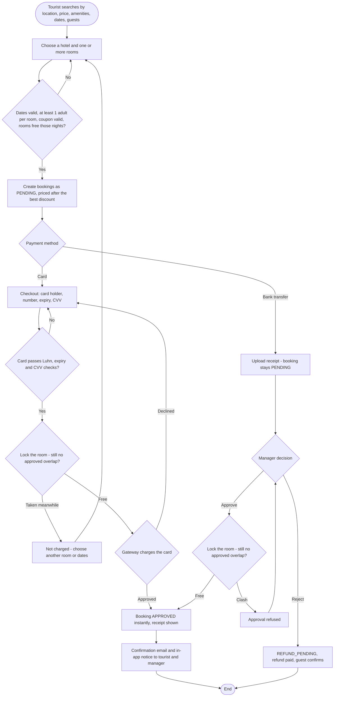

### 6.4 Itinerary and Local Experience - `AgentController`, `AgentService`, `AttractionController`

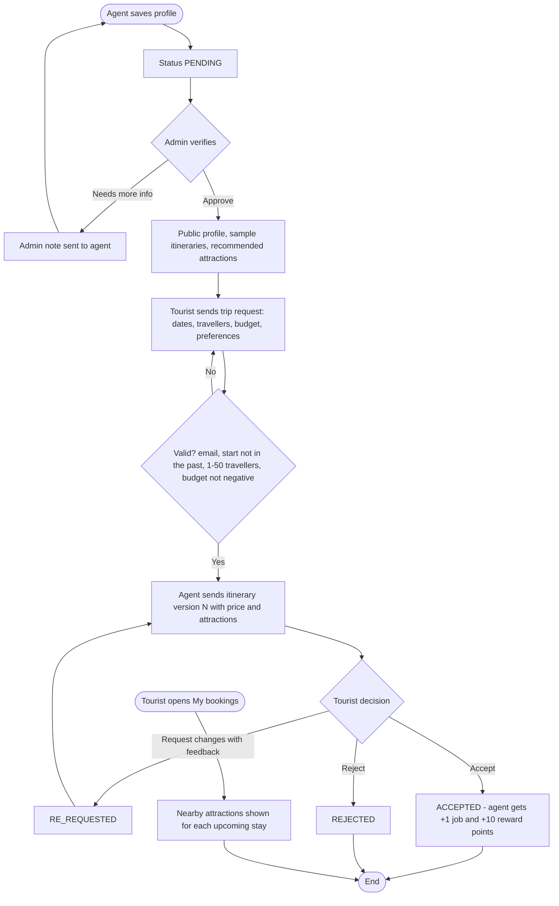

### 6.5 Promotion Management - `PromotionController`, `PromotionService`, pricing strategies

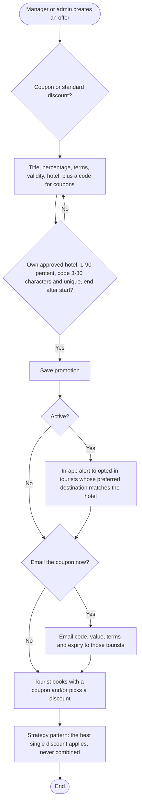

### 6.6 Inquiry and Feedback - `InquiryController`, `ReviewController`

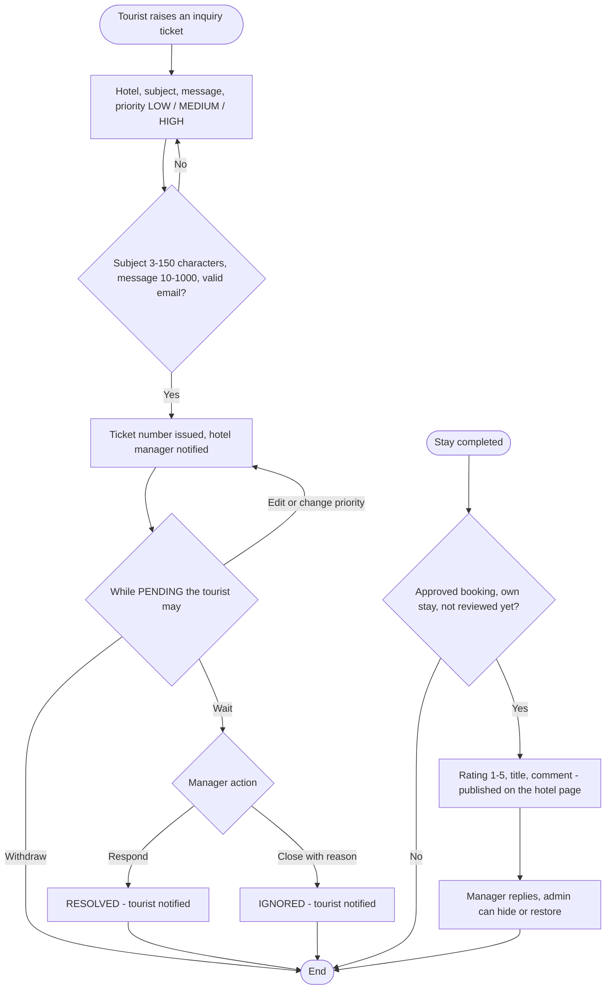
